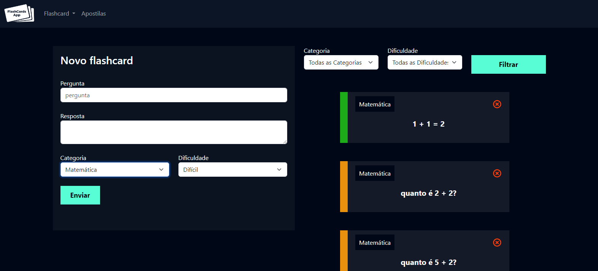
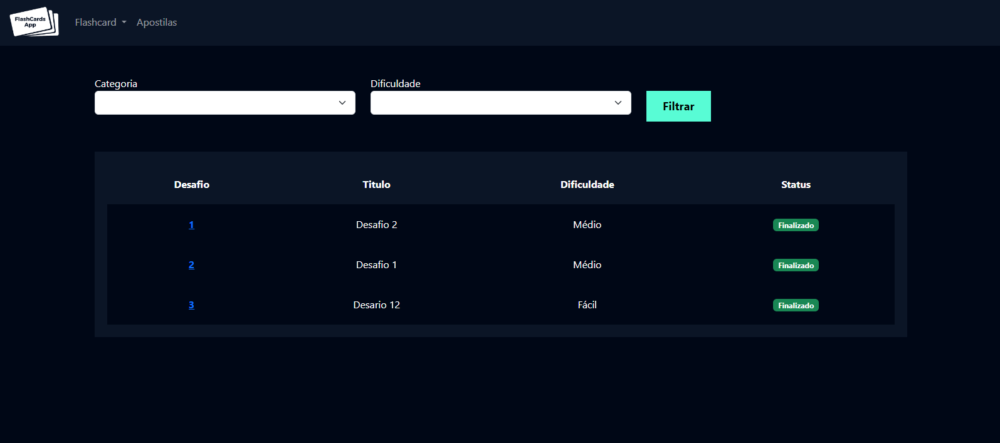
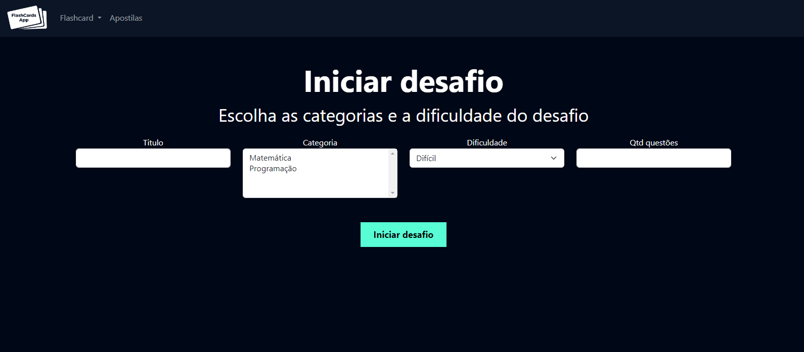
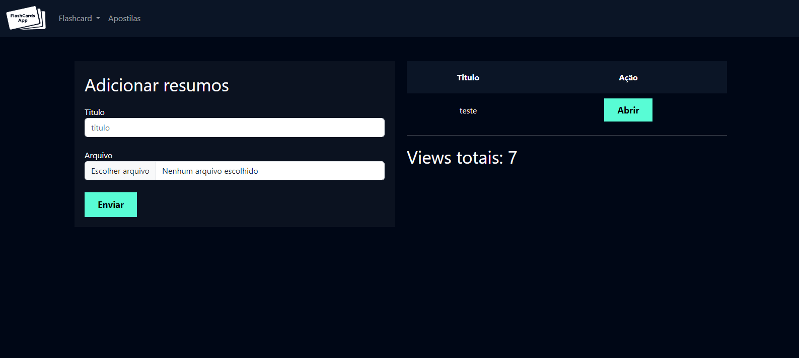

<h1 align="center">
    
</h1>

<p align="center">
 <a href="#-project">Project</a> •
 <a href="#-features">Features</a> •
 <a href="#-layout">Layout</a> • 
 <a href="#-built-with">Built With</a> • 
 <a href="#-license">License</a>
</p>

<h4 align="center"> 
	🚧 Completed!  🚧
</h4>

---
 
## 💻 Project
*"Learn Fast, Remember More"*
FlashCardsApp is a user-friendly platform designed to create, organize, and review flashcards, helping you study more efficiently.

---

## ⚙️ Features
- [x] Create and edit flashcards.
- [x] Organize flashcards into decks.
- [x] Review flashcards with different modes.
- [x] Intuitive and responsive interface.
- [x] Handbook storage.

---

## 🎨 Layout

### Web

<p align="center"> Screenshot <br>
  
</p>
<p align="center"><br>
  
</p>
<p align="center"><br>
  
</p>
<p align="center"><br>
  
</p>

---
## Installation

### Prerequisites
- Python 3.x
- Django 4.x
- Node.js

### Steps
1. Clone the repository:
	  ```bash
	   git clone https://github.com/seu-usuario/FlashCardsApp.git
2. Navigate to the project directory:
	  ```bash
	  cd FlashCardsApp

3. Install the dependencies:
	  ```bash
	  pip install -r requirements.txt

4. Install django packages:
	```bash
 	pip install django

5. Apply database migrations:
	```bash
 	python manage.py migrate

6. Start the development server:
	```bash
 	python manage.py runserver

### Usage
1. Visit http://127.0.0.1:8000/ in your browser.
2. Sign up or log in.
3. Start creating your flashcards and organizing them into decks.

---
## 🛠 Built With

- [Python][python]
- [javaScript][javascript]
- [CSS][css]
- [Html][html]
- [Django][django]

---

## 📝 License

Distributed under the MIT License.

Feito com ❤️ por neverton Sousa 👋🏽 [Entre em contato!](https://www.linkedin.com/in/neverton-sousa-191708249/)


[python]: https://nodejs.org/](https://www.python.org/
[css]: https://www.python.org/](https://www.w3schools.com/css/
[javascript]: https://www.python.org/](https://developer.mozilla.org/pt-BR/docs/Web/JavaScript](https://www.w3schools.com/js/
[firebase]: https://www.typescriptlang.org/](https://firebase.google.com/
[django]: https://www.djangoproject.com/
[html]: https://reactjs.org](https://www.w3schools.com/html/
[rn]: https://facebook.github.io/react-native/
[yarn]: https://yarnpkg.com/
[vscode]: https://code.visualstudio.com/
[vceditconfig]: https://marketplace.visualstudio.com/items?itemName=EditorConfig.EditorConfig
[license]: https://opensource.org/licenses/MIT
[vceslint]: https://marketplace.visualstudio.com/items?itemName=dbaeumer.vscode-eslint
[prettier]: https://marketplace.visualstudio.com/items?itemName=esbenp.prettier-vscode
[rs]: https://rocketseat.com.br
